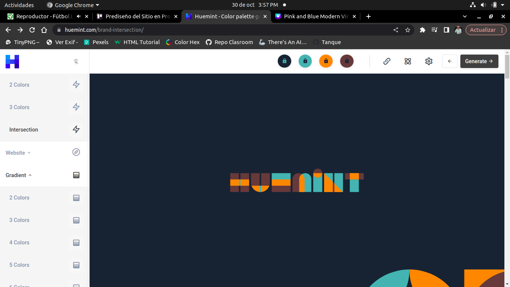
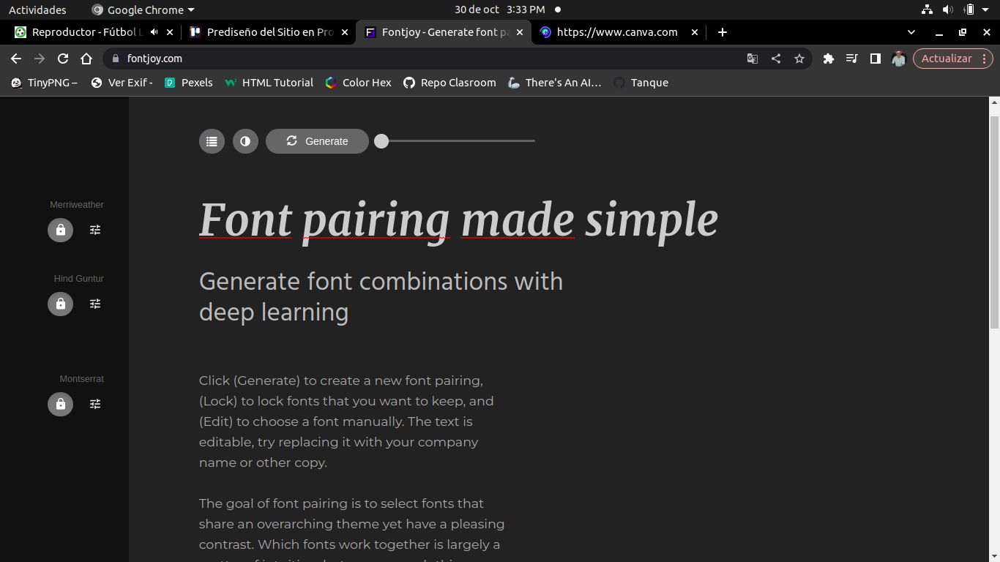

# Proyecto Final Especialidad 11°- Portafolio Personal
#### Especialidad en Sistemas-Grado 11- Proyecto Periodo IV-Portafolio Personal y Profesional

## Estructura Estática del Sitio
### Páginas que tendrá
1. Pagina Principal (index.html)
2. Página sobre mi (yo.html)
3. Página sobre los servicios/productos que ofrezco (servicio.html)
4. Página de Portafolio. Mis proyectos y lo que soy capa de hacer (port.html)   NO
5. Página sobre mi carrera (carrera.html)
6. Página para poner mi información de contacto (contacto.html) 
7. Blog o Foro (foro.html o foro.php) FALTA
8. Página de la tienda (tienda.html)
9. Página para Registrarse (register.html)
10. Página para para Iniciar Sesión (login.html)
11. Carpeta de estilos CSS (/css/)
12. Carpeta de funcionales JS (/js/)
13. Carpeta de Imagenes (/img/)

### Posibles nombres para el sitio
- Codemax
- CodeGenius
- TechGenius
- Progranet
- JNCoding (Elegido)

### Logo
- Pineapple. Algo con una piña

### Paleta de Colores
1. Codigo de color #182532
2. Codigo de color #63b0af
3. Codigo de color #ff881a
4. Codigo de color #613c3c

#### Enlace
https://huemint.com/brand-intersection/#palette=182532-63b0af-ff881a-613c3c

### Fuentes de Letra
1. Titulos: Merriweather
Para importar: @import url('https://fonts.googleapis.com/css2?family=Merriweather:ital,wght@0,300;0,400;0,700;0,900;1,300;1,400;1,700;1,900&display=swap');
Enlace: https://fonts.google.com/specimen/Merriweather

2. Subtitulos: Hind Gurtur
Para importar: @import url('https://fonts.googleapis.com/css2?family=Hind+Guntur:wght@300;400;500;600;700&display=swap');
Enlace:https://fonts.google.com/specimen/Hind+Guntur

3. Texto plano:Montserrat
Para Importar:@import url('https://fonts.googleapis.com/css2?family=Montserrat:ital,wght@0,100;0,200;0,300;0,400;0,500;0,600;1,400&display=swap');
Enlace:https://fonts.google.com/specimen/Montserrat

